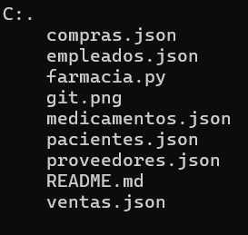

# Trabajo_Python_MachucaYessica

La farmacia desea implementar un sistema integral de gestión que permita manejar todas las operaciones relacionadas con la administración de medicamentos, proveedores, empleados, pacientes, así como la generación de informes relevantes.

## Descripción

La página consta de ciertas especificaciones las cuales son:

1. Ventas: El sistema debe permitir registrar cada transacción de venta.
2. Compras: El sistema debe permitir registrar cada compra realizada a los proveedores.

## Tecnologías utilizadas 
| Python |
|--|
||

## Estructura del proyecto 

Aqí podras observar todo lo utilizado para desarrollar el proyecto:

Al inicio podrás ver 6 archivos [json], [farmacia.py] y [README.md].

## Caracteristícas 

* Archivo [farmacia.py]:Consta del código principal del proyecto.
* Archivo [json]:Consta de los recursos necesarios para desarrollar el proyecto.
* Archivo [README.md]:Documentación de la estructura del código principal.

## Diseño 

El diseño se realizo con el fin de que la página pueda ser utilizada por cualquier usuario y la pueda entender.

## Instrucciones 

1. Clonar el repositorio cargado en GitHub.
2. Abrir en la nube el archivo Python.

## Desarrollado por 

Realizado por Yessica Andrea Perez Machuca estudiante de Campuslands como trabajo de práctica en el módulo Git.
